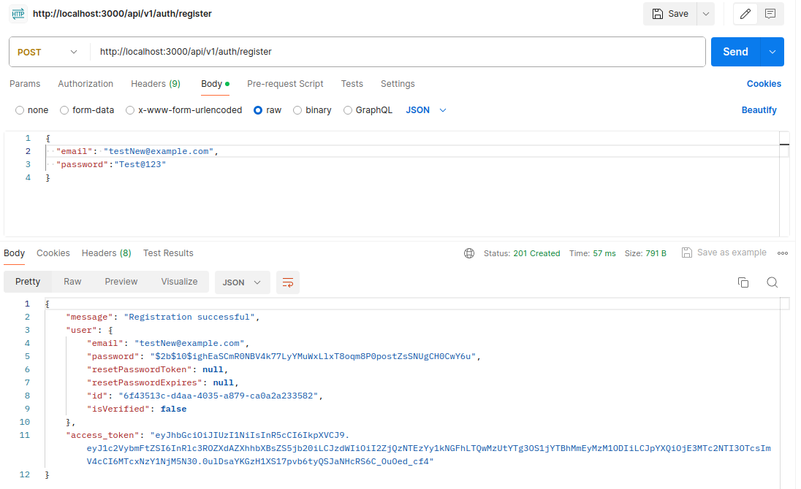
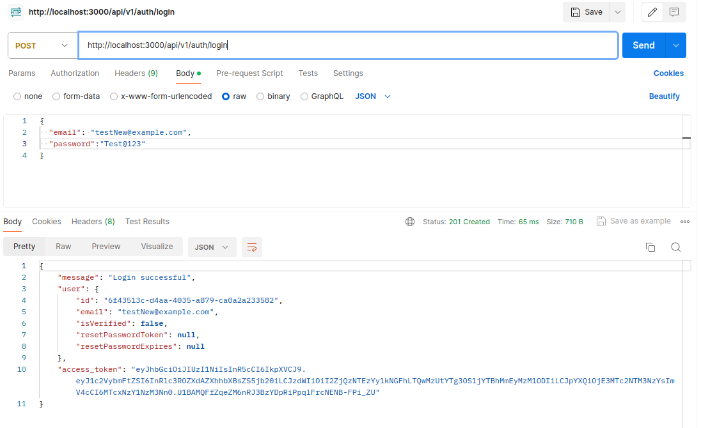
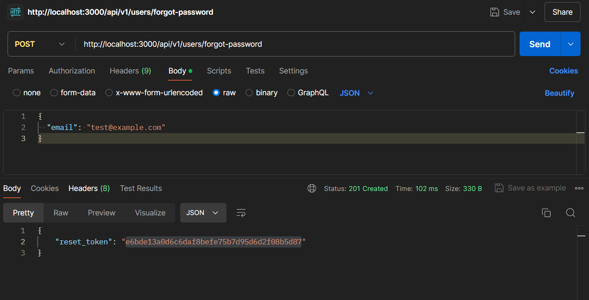

# Building a Secure Authentication System with NestJS, PostgreSQL, and TypeORM: A Comprehensive Guide

The combination of **NestJS**, **TypeORM**, and **PostgreSQL** provides a scalable, and efficient stack for developing web services. This article gives a general outline of constructing a basic, yet operational web service using these tools. We will look into the fundamentals of each element, and their collaboration, and guide you through a straightforward example to kickstart your project.

## Introduction to the Stack

### NestJS

NestJS is a framework for building efficient, scalable [Node.js](https://nodejs.org/en) server-side applications. It uses progressive JavaScript, is built with and fully supports [TypeScript](https://www.typescriptlang.org/) (yet still enables developers to code in pure JavaScript) and combines elements of OOP (Object Oriented Programming), FP (Functional Programming), and FRP (Functional Reactive Programming).

### TypeORM

TypeORM is an [ORM](https://en.wikipedia.org/wiki/Object%E2%80%93relational_mapping) (Object-Relational Mapping) library that can run in Node.js and can be used with TypeScript and JavaScript (ES5+). It supports the Active Record and Data Mapper patterns, unlike all other JavaScript ORMs currently in existence, which means you can write high-quality, loosely coupled, scalable, maintainable applications most efficiently.

### PostgreSQL

PostgreSQL is a powerful, open-source object-relational database system that uses and extends the SQL language combined with many features that safely store and scale the most complicated data workloads.

## Requirements

- Node.js (version >= 16)
- npm (or Yarn)
- PostgreSQL
- (OPTIONAL) Docker and Postman

## STEP 1 : Setting Up the Project

> Create a new NestJS project

```
npm i -g @nestjs/cli nest new project-name
```

Navigate into your project directory before proceeding.

> Install TypeORM and PostgreSQL

```
npm install --save @nestjs/config @nestjs/typeorm typeorm pg class-validator class-transformer
```

- _@nestjs/config_: NestJS module for configuration
- _@nestjs/typeorm_: NestJS module for TypeORM
- _typeorm_: ORM for NodeJS
- _pg_: Postgres driver for NodeJS
- _class-validator_: Allows you to use decorator-based validation for class properties.
- _class-transformer_: Enables transforming plain objects to class instances and vice versa, essential for applying validation rules to incoming request data.

> Database Connection

- create an `.env` in the root of your project

```
POSTGRES_HOST=localhost
POSTGRES_PORT=5432
POSTGRES_USER=postgres
POSTGRES_PASSWORD=jimmy@246
POSTGRES_DB=crud-rest-api
```

- create an typeormconfig.ts file to configure TypeORM with PostgreSQL

```
import { registerAs } from '@nestjs/config';
import { config as dotenvConfig } from 'dotenv';
import { DataSource, DataSourceOptions } from 'typeorm';

dotenvConfig({ path: '.env' });

const config = {
  type: 'postgres',
  host: `${process.env.POSTGRES_HOST}`,
  port: `${process.env.POSTGRES_PORT}`,
  username: `${process.env.POSTGRES_USER}`,
  password: `${process.env.POSTGRES_PASSWORD}`,
  database: `${process.env.POSTGRES_DB}`,
  entities: ['dist/**/*.entity{.ts,.js}'],
  migrations: ['dist/migrations/*{.ts,.js}'],
  autoLoadEntities: true,
  synchronize: true,
};

export default registerAs('typeorm', () => config);
export const connectionSource = new DataSource(config as DataSourceOptions);
```

- Add `app.setGlobalPrefix('api/v1'); in main.ts` (OPTIONAL)

  - It adds the prefix api/v1 to every route registered in the application.
  - This means all API endpoints will be accessible under the api/v1 path.

- Add `app.enableCors(); in main.ts` (OPTIONAL)

  - Allows requests from frontend applications on different domains to access the API endpoints.
  - Improves security by controlling which origins (domains or subdomains) can make requests to the API.

## STEP 2 : Integrate Config into Nestjs

- To add the typeorm.ts into the main root module, which is mostly named as app.module.ts

```import { Module } from '@nestjs/common';
import { AppController } from './app.controller';
import { AppService } from './app.service';
import { ConfigModule, ConfigService } from '@nestjs/config';
import { TypeOrmModule } from '@nestjs/typeorm';
import typeorm from './config/typeormconfig';

@Module({
  imports: [
    ConfigModule.forRoot({
      isGlobal: true,
      load: [typeorm],
    }),
    TypeOrmModule.forRootAsync({
      inject: [ConfigService],
      useFactory: async (configService: ConfigService) =>
        configService.get('typeorm'),
    }),
  ],
  controllers: [AppController],
  providers: [AppService],
})
export class AppModule {}
```

In the AppModule, NestJS uses ConfigModule to globally load application configurations, including TypeORM options defined in config/typeorm.ts. The TypeOrmModule.forRootAsync method fetches TypeORM configuration asynchronously via ConfigService, enabling seamless integration with the application's configuration.

## STEP 3 : Creating User Entity and Repository

> Create User Entity:

Generate a new module, service, and controller for users:

```
nest generate module users
nest generate service users
nest generate controller users
```

> Define User Entity:

In src/users/user.entity.ts, define your user entity:

```
import { Entity, Column, PrimaryGeneratedColumn } from 'typeorm';

@Entity()
export class User {
  @PrimaryGeneratedColumn('uuid')
  id: string;

  @Column()
  email: string;

  @Column()
  password: string;

  @Column({ default: false })
  isVerified: boolean;

  @Column({ nullable: true })
  resetPasswordToken: string;

  @Column({ nullable: true })
  resetPasswordExpires: Date;
}
```

## STEP 4 : Implementing Authentication :

> 1. Install Passport and JWT Dependencies:

```
npm install --save @nestjs/passport @nestjs/jwt passport passport-jwt bcrypt
npm install --save-dev @types/passport-jwt @types/bcrypt
```

- _@nestjs/passport_ : Provides integration between NestJS and Passport, a popular authentication middleware for Node.js. It simplifies the implementation of various authentication strategies in NestJS applications.
- _@nestjs/jwt_ : Adds support for JWT (JSON Web Tokens) in NestJS applications. It helps in creating, signing, and verifying JWTs, which are often used for securing APIs through token-based authentication.
- _passport_ : A general authentication middleware for Node.js. It is designed to authenticate requests and is extremely flexible and modular, allowing the use of various authentication strategies.
- _passport-jwt_ : A Passport strategy for authenticating with a JSON Web Token. This module lets you authenticate endpoints using a JWT, making it ideal for securing RESTful APIs.
- _bcrypt_ : A library for hashing and comparing passwords using the bcrypt algorithm. It is widely used for securing user passwords before storing them in a database.
- _@types/passport-jwt_ : TypeScript type definitions for the passport-jwt module. These types help ensure type safety and better development experience when using passport-jwt in a TypeScript project.
- _@types/bcrypt_ : TypeScript type definitions for the bcrypt module. These types provide type information and help with type safety when using bcrypt in a TypeScript project.

> 2. Create Auth Module:

Generate a new module, service, and controller for authentication:

```
nest generate module auth
nest generate service auth
nest generate controller auth
```

> 3. Configure JWT Strategy:

configure the JWT strategy

```
import { Injectable } from '@nestjs/common';
import { PassportStrategy } from '@nestjs/passport';
import { ExtractJwt, Strategy } from 'passport-jwt';

@Injectable()
export class JwtStrategy extends PassportStrategy(Strategy) {
  constructor() {
    super({
      jwtFromRequest: ExtractJwt.fromAuthHeaderAsBearerToken(),
      ignoreExpiration: false,
      secretOrKey: 'your_jwt_secret_key',
    });
  }

  async validate(payload: any) {
    return { userId: payload.sub, username: payload.username };
  }
}
```

> 4. Configure Auth Module:

configure the authentication module:

```
import { Module } from '@nestjs/common';
import { JwtModule } from '@nestjs/jwt';
import { PassportModule } from '@nestjs/passport';
import { AuthService } from './auth.service';
import { UsersModule } from '../users/users.module';
import { JwtStrategy } from './jwt.strategy';

@Module({
  imports: [
    UsersModule,
    PassportModule,
    JwtModule.register({
      secret: 'your_jwt_secret_key',
      signOptions: { expiresIn: '60m' },
    }),
  ],
  providers: [AuthService, JwtStrategy],
  controllers: [AuthController],
  exports: [AuthService],
})
export class AuthModule {}
```

> 5. Implement Auth Service:

implement the authentication logic:

```
import { Injectable } from '@nestjs/common';
import { JwtService } from '@nestjs/jwt';
import { UsersService } from '../users/users.service';
import * as bcrypt from 'bcrypt';

@Injectable()
export class AuthService {
  constructor(
    private usersService: UsersService,
    private jwtService: JwtService,
  ) {}

  async validateUser(email: string, pass: string): Promise<any> {
    const user = await this.usersService.findOneByEmail(email);
    if (user && bcrypt.compareSync(pass, user.password)) {
      const { password, ...result } = user;
      return result;
    }
    return null;
  }

  async login(user: any) {
    const payload = { username: user.email, sub: user.id };
    return {
      access_token: this.jwtService.sign(payload),
    };
  }

  async register(email: string, pass: string): Promise<any> {
    const hashedPassword = bcrypt.hashSync(pass, 10);
    return this.usersService.create({
      email,
      password: hashedPassword,
    });
  }
}
```

> 6. Add Login and Register Endpoints:

add endpoints for login and register:

```
import { Controller, Request, Post, UseGuards, Body } from '@nestjs/common';
import { AuthService } from './auth.service';

@Controller('auth')
export class AuthController {
  constructor(private authService: AuthService) {}

  @Post('login')
  async login(@Body() body: any) {
    return this.authService.login(body);
  }

  @Post('register')
  async register(@Body() body: any) {
    return this.authService.register(body.email, body.password);
  }
}
```

## STEP 5 : Implementing Forgot Password and Reset Password

> 1. Add Forgot Password Method in Users Service:

```
import { Injectable } from '@nestjs/common';
import { InjectRepository } from '@nestjs/typeorm';
import { Repository, MoreThan } from 'typeorm';
import { User } from './entities/user.entity';
import * as bcrypt from 'bcrypt';

@Injectable()
export class UsersService {
  constructor(
    @InjectRepository(User)
    private usersRepository: Repository<User>,
  ) {}

  async findOneByEmail(email: string): Promise<User | undefined> {
    return this.usersRepository.findOne({ email });
  }

  async create(user: Partial<User>): Promise<User> {
    return this.usersRepository.save(user);
  }

  async setResetPasswordToken(email: string, token: string, expires: Date) {
    const user = await this.findOneByEmail(email);
    if (user) {
      user.resetPasswordToken = token;
      user.resetPasswordExpires = expires;
      return this.usersRepository.save(user);
    }
    return null;
  }

  async resetPassword(token: string, newPassword: string) {
    const user = await this.usersRepository.findOne({
      where: {
        resetPasswordToken: token,
        resetPasswordExpires: MoreThan(new Date()),
      },
    });
    if (user) {
      user.password = bcrypt.hashSync(newPassword, 10);
      user.resetPasswordToken = null;
      user.resetPasswordExpires = null;
      return this.usersRepository.save(user);
    }
    return null;
  }
}
```

> 2. Add Forgot Password and Reset Password Endpoints:

add endpoints for forgot and reset password:

```
import { Controller, Post, Body } from '@nestjs/common';
import { UsersService } from './users.service';
import * as crypto from 'crypto';

@Controller('users')
export class UsersController {
  constructor(private usersService: UsersService) {}

  @Post('forgot-password')
  async forgotPassword(@Body('email') email: string) {
    const token = crypto.randomBytes(20).toString('hex');
    const expires = new Date();
    expires.setHours(expires.getHours() + 1); // Token expires in 1 hour
    const user = await this.usersService.setResetPasswordToken(email, token, expires);
    if (user) {
      // Send token to user's email
      // await this.mailService.sendResetPasswordMail(email, token);
      return { reset_token: token };
    }
    return { message: 'If email exists, reset token has been sent' };
  }

  @Post('reset-password')
  async resetPassword(@Body() body: any) {
    const { token, newPassword } = body;
    const user = await this.usersService.resetPassword(token, newPassword);
    if (user) {
      return { message: 'Password successfully reset' };
    }
    return { message: 'Invalid or expired token' };
  }
}
```








